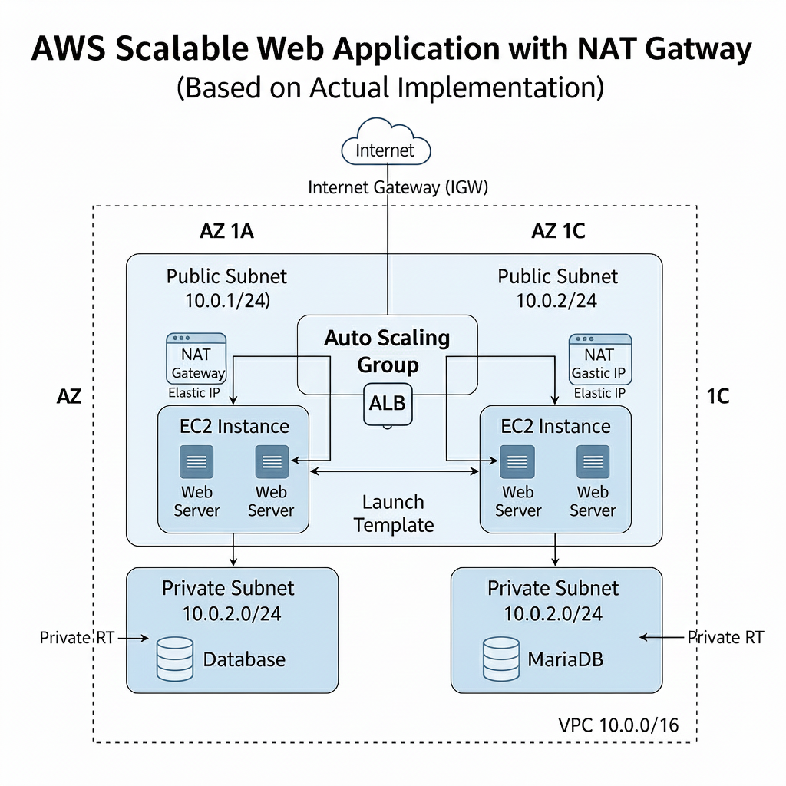

# 2. EC2 기반 자동 확장 웹 서비스 구축 (ALB + Auto Scaling Group)

이 프로젝트는 앞서 구축한 Multi-AZ VPC 환경 위에 **Application Load Balancer (ALB)**와 **Auto Scaling Group (ASG)**을 구성하여, 트래픽 변화에 따라 서버 수가 자동으로 조절되고 장애 발생 시 스스로 복구되는 **탄력적(Elastic)이고 고가용성(HA)** 있는 웹 서비스를 구축한 실습입니다.

---

## 아키텍처 다이어그램

---

## 실습 목표
* **자동 확장성(Elasticity) 확보:** 트래픽 부하에 따라 서버 인스턴스 수를 자동으로 조절하는 능력 구현
* **자가 복구(Self-Healing) 구현:** 인스턴스 장애 발생 시, ASG가 자동으로 감지하고 새로운 인스턴스로 대체하는 내결함성 확보
* **부하 분산 구현:** ALB를 통해 여러 AZ에 걸친 EC2 인스턴스로 트래픽을 균등하게 분산
* 무중단 서비스 구조 이해 및 Launch Template을 이용한 서버 구성 표준화

---

## 사용 AWS 서비스

### 로드 밸런싱 & 자동 확장
* **Application Load Balancer (ALB):** L7 계층 부하 분산 및 헬스 체크
* **Target Group:** ALB가 트래픽을 전달할 EC2 인스턴스들의 집합
* **Launch Template:** ASG에 의해 실행될 EC2 인스턴스의 구성 템플릿 (User Data 스크립트 포함)
* **Auto Scaling Group (ASG):** 최소/최대/희망 용량 관리 및 자동 스케일링 정책 실행

### 컴퓨팅 & 네트워크
* **EC2 (Web Server):** ASG에 의해 관리되는 웹 서버
* **VPC, Public Subnet, Security Group:** (이전 실습에서 구축)

---

## 트래픽 및 확장 흐름

1.  **사용자 접속:** 외부 사용자가 **ALB의 DNS 주소**로 접속합니다.
2.  **트래픽 분산:** ALB는 Target Group에 등록된 **Public Subnet의 건강한 EC2 인스턴스**로 트래픽을 균등하게 분배합니다.
3.  **자동 확장/축소 (Scale In/Out):** CPU 사용률 등 메트릭 기반으로 ASG가 인스턴스 수를 자동으로 조절합니다.
4.  **자가 복구 (Self-Healing):** 헬스 체크 실패 시, ASG가 해당 인스턴스를 즉시 교체 생성하여 서비스 연속성을 보장합니다.

---

## 핵심 학습 포인트
* **클라우드 탄력성(Elasticity) 구현:** 인프라 자원을 트래픽 변화에 맞춰 유연하게 운영하는 실전 경험 확보
* **내결함성(Fault Tolerance) 설계:** ASG와 Multi-AZ 구조를 통한 자동 복구 능력 구현
* **부하 분산 메커니즘 이해:** ALB 헬스 체크 및 분산 방식의 동작 원리 체득
* Launch Template을 이용한 서버 자동 배포 설정 경험 확보
