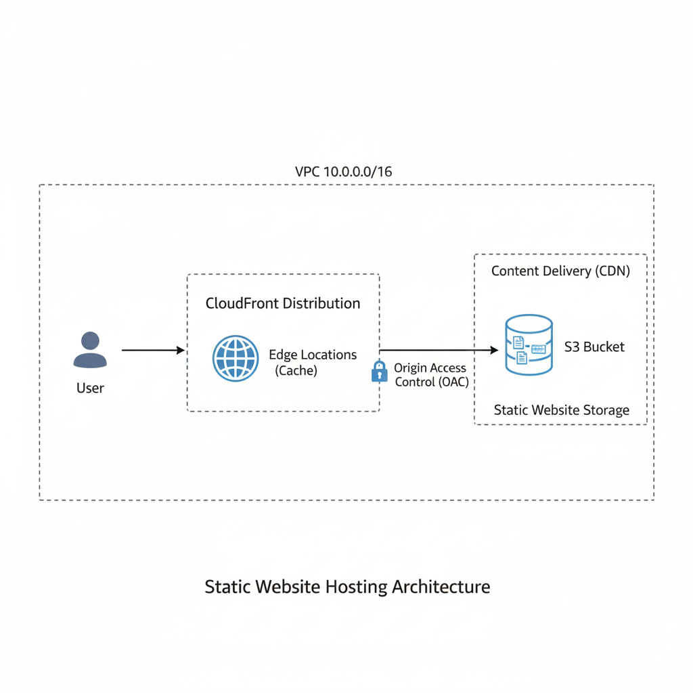

# 3. S3 + CloudFront 静的ウェブサイト配信（CDN とセキュリティ強化）

本プロジェクトでは、Amazon S3 を利用して静的コンテンツを保存し、  
CloudFront（CDN）によって配信速度を最適化し、  
さらに Origin Access Control（OAC）を用いてセキュリティを強化する、  
現代的な静的ウェブサイト配信アーキテクチャを構築しました。

---

## アーキテクチャ図

---

## 学習目標

- CDN（Content Delivery Network）の概念と活用方法の理解  
- S3 を用いた静的ウェブサイトホスティングの仕組みの理解  
- OAC（Origin Access Control）を利用したセキュリティ強化  
- 配信速度の最適化とグローバルユーザーへのサービス提供方法の習得  

---

## 使用した AWS サービス

### ストレージ & CDN

- **S3（Simple Storage Service）：** 静的ファイル（HTML、CSS など）の保存
- **CloudFront（CDN）：** キャッシュとエッジロケーションによる高速配信
- **Origin Access Control（OAC）：** CloudFront が非公開 S3 バケットへ安全にアクセスするための認証メカニズム

### その他
- **Route 53（任意）：** 独自ドメインの接続

---

## トラフィックフロー

1. 利用者が CloudFront のドメインにアクセスする  
2. CloudFront が最寄りのエッジロケーションにキャッシュがあるか確認  
3. キャッシュにない場合、CloudFront が OAC 認証を用いて S3（オリジン）へリクエスト  
4. S3 は、OAC 権限を持つ CloudFront のみからのアクセスを許可  
5. CloudFront が取得したコンテンツを利用者に返し、  
   次回リクエストのためにエッジロケーションへキャッシュ  

---

## 主要な学習ポイント

- OAC によるセキュアな静的コンテンツ配信構成の実現  
- CDN のキャッシュメカニズムと低遅延配信の理解  
- S3 の高い耐久性とコスト効率を活かしたデータ保存と配信の実践的理解  

