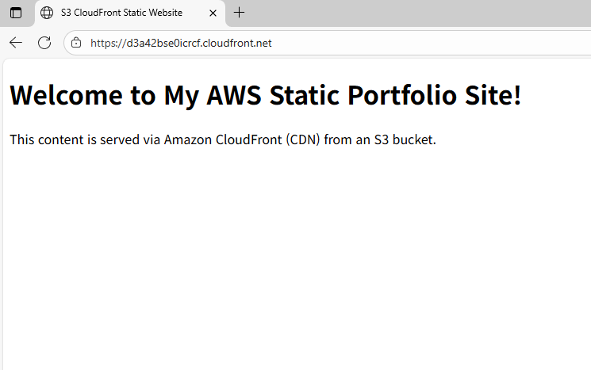

# AWS Multi-AZ Web Architecture  
VPC + Public/Private Subnet + NAT Gateway + ALB + EC2

本プロジェクトでは、AWS において実際のサービスでも広く利用されている  
高可用性（High Availability）Web アーキテクチャを構築しながら学習を行いました。

Public / Private Subnet の分離、NAT Gateway を利用したアウトバウンド制御、  
Auto Scaling による拡張性など、クラウドインフラの基本的な概念を理解することを目的としています。

---

## アーキテクチャ図

---

## 学習目標
- VPC ネットワーク構造の理解  
- 2つの AZ を利用した高可用性アーキテクチャ設計  
- Public / Private Subnet の役割の違いを理解  
- NAT Gateway を利用した安全なアウトバウンド設計  
- ALB を用いたトラフィック分散の仕組みの理解  
- Route Table によるトラフィック制御の基本を習得  

---

## 使用した AWS サービス

### ネットワーク
- VPC (10.0.0.0/16)
- Public Subnet 1a / 1c
- Private Subnet 1a / 1c
- Internet Gateway (IGW)
- NAT Gateway
- Route Table（Public / Private）

### コンピューティング
- EC2 Web Server（Public Subnet）
- Bastion Host（任意）

### ロードバランサ
- Application Load Balancer（ALB）

---

## トラフィックフロー
1. 利用者が ALB にアクセス  
2. ALB が Public Subnet 上の EC2 Web Server にトラフィックを転送  
3. Public Subnet の EC2 は IGW を通してインターネットへ直接アクセス可能  
4. Private Subnet に配置されるデータベース等のリソースは、  
   アウトバウンド通信が必要な場合 NAT Gateway を経由するように設計  

---

## ルーティング設定

### Public Route Table
0.0.0.0/0 → Internet Gateway

### Private Route Table
0.0.0.0/0 → NAT Gateway

---

## 主要な学習ポイント
- マルチ AZ による高可用性の考え方  
- Subnet を Public / Private に分離する実務的な意義  
- NAT Gateway を用いたセキュアなアウトバウンド構成  
- ALB のヘルスチェックおよびロードバランシングの動作理解  
- AWS ネットワークの基本構成要素を実際に扱うことで得られる実践的理解  

---

## 結果画面

