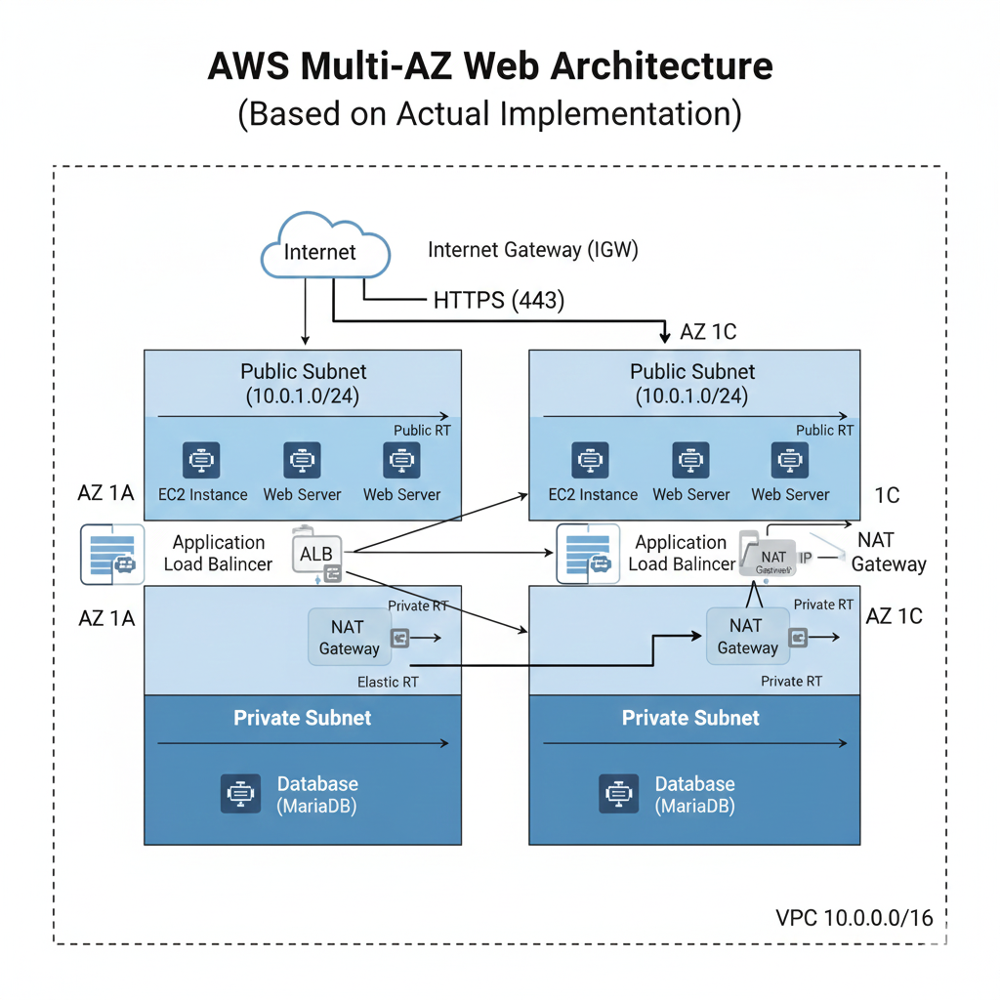

# AWS Multi-AZ Web Architecture  
VPC + Public/Private Subnet + NAT Gateway + ALB + EC2

이 프로젝트는 AWS에서 실제 서비스에서도 가장 널리 사용되는  
**고가용성(High Availability) 웹 아키텍처**를 직접 구성하며 학습한 실습입니다.

Public/Private Subnet 분리, NAT Gateway 통한 아웃바운드, ASG 기반 확장성 등  
실무 인프라 개념을 체득하는 것을 목표로 했습니다.

---

## 아키텍처 다이어그램

---

## 실습 목표
- VPC 네트워크 구조 이해
- 2개 AZ 기반 고가용성 구조 설계
- Public / Private Subnet의 역할 구분
- NAT Gateway를 이용한 안전한 아웃바운드 설계
- ALB 기반 트래픽 분산 구조 구성
- Route Table 기반 트래픽 흐름 이해

---

## 사용 AWS 서비스

### 네트워크
- **VPC (10.0.0.0/16)**
- **Public Subnet 1a / 1c**
- **Private Subnet 1a / 1c**
- **Internet Gateway (IGW)**
- **NAT Gateway**
- **Route Table (Public / Private)**

### 컴퓨팅
* **EC2 Web Server (Public Subnet)**
* Bastion Host (옵션)

### 로드 밸런싱
- **Application Load Balancer (ALB)**

---

## 트래픽 흐름
1. 외부 사용자가 **ALB**로 접속  
2. **ALB가 Public Subnet의 EC2 Web Server로 트래픽 전달**
3. **Public Subnet의 EC2는 IGW를 사용하여 인터넷에 직접 접근 가능**
4. **Private Subnet에 배치될 데이터베이스 등의 리소스는 NAT Gateway를 통해 아웃바운드되도록 설계됨**

---

## 라우팅 구성

### Public Route Table
0.0.0.0/0 → Internet Gateway

### Private Route Table
0.0.0.0/0 → NAT Gateway

---

## 핵심 학습 포인트

- 멀티 AZ 기반 고가용성 설계 이해
- Subnet 분리(퍼블릭 / 프라이빗)의 실무적 의미 체득
- NAT Gateway를 통한 보안적 인터넷 연결 구조
- ALB의 헬스 체크 및 로드 밸런싱 동작 방식 이해
- 기본 AWS 네트워크 구성 요소의 실전 감각 확보

## 결과 

